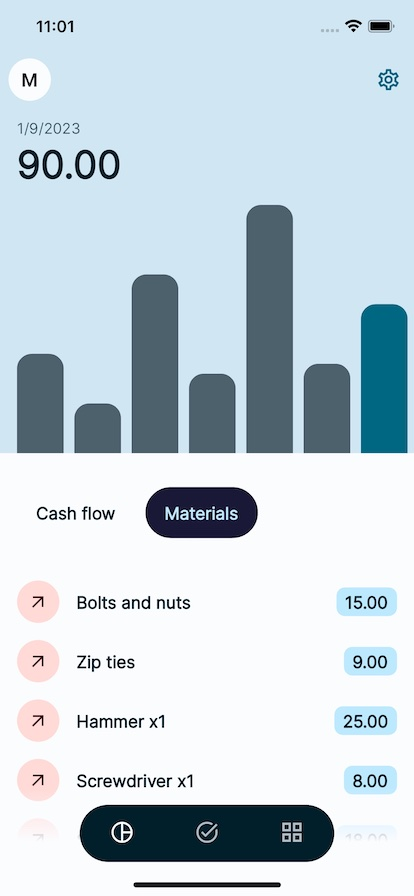

# OS CORP (WIP)
Mobile app for construction and maintenance business to keep track of expenses/credit and completed tasks



### Features
- Expense tracking
- Tasks tracking
- Virtual drive for file sharing


### Next steps
- Complete overhaul for the user interface
- Automatically update tasks and expenses
- Customize user experience with new functionalities

### Development

Build functions
`cd functions && npm run build`

Start emulators
`firebase emulators:start --import ./data --export-on-exit`

Build container
`docker-compose build --build-arg EMULATOR_HOST=localhost`

Start container
`docker-compose up`

Run app
`flutter run --dart-define=EMULATOR_HOST=localhost`

Setup Firebase
```bash
firebase init
cd app && flutterfire configure
```
